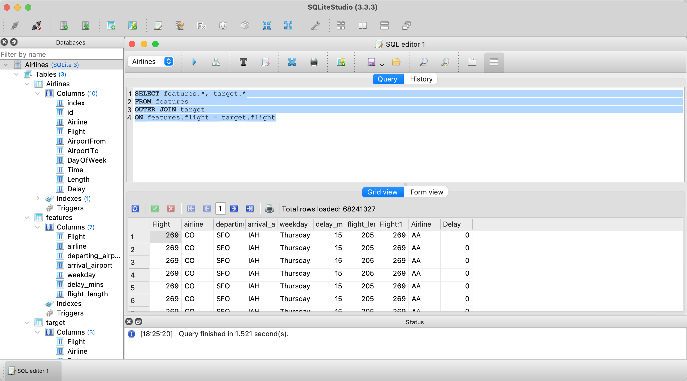

# Airline_Delay

## Selected Topic

***Airline Delay***

Google Slide Presentation can be viewed [here.](https://docs.google.com/presentation/d/1Gdb_rvwP0_uNhjOWyThWgazxaziDxe8qXib3i6_Qr8g/edit#slide=id.g13c2af1fd4b_2_26144)

## Reason
COVID-19 once stalled much of airline businesses as travel became scarce. In recent months, especially since it has become warm and people are going on summer holidays, airline travel has resumed. However, we've noticed that there are more and more delays in flights that often mess up people's schedules. We are curious to know in more detail which airlines have more delays, which airports, and which flights (origin - destination) are causing more of the delay data.

## Description of the source of data
Airlines dataset has 539383 instances and 8 different features. 

Columns include: 
- I. Airline 
- II. Flight 
- III. Airport From 
- IV. Airport To 
- V. DayOfWeek 
- VI. Time
- VII. ID
- VIII. Length 
- IX. Delay

## Questions hope to answer with the data
The goal of this project is to build a flight delay prediction model that predicts whether a given flight will be delayed depending on factors such as: 

- Airline
- Departing Airport
- Day of Week 

## Machine Learning Model 

***Random Forest Classifier***

## Database

The Link to the Database downloaded can be found [here.](https://www.kaggle.com/datasets/jimschacko/airlines-dataset-to-predict-a-delay?datasetId=2285093&group=owned)

### SEGMENT 2

Column titles were update as well as 2 tables created. Table 1 is the features table with a converted DayOfWeek column that lists a string of the actual weekday. Table 2 is our target table that includes the airline abbreviations and delay. 

We decided to keep all columns as features (except delay). We felt that these columns would best fit the questions we are aiming to answer with the unique identified being flight number. These include: 
- Flight
- airline
- departing_airport
- arrival_airport
- weekday
- delay_mins
- flight_length

 We created a connection between sqlite3 and Airlines.db, then addded features_df and target_df to this database. After this, we commited the connection and then executed sql databse in SQLiteStudio. The tables were merged as an OUTERJOIN to complete the full table as this adds the delay column and includes the airlines. 

***Description of preliminary data preprocessing***

***Description of preliminary feature engineering and preliminary feature selection, including their decision-making process***

***Description of how data was split into training and testing splits***

***Explanation of model choice, including limitations and benefits***

 We created a connection between sqlite3 and Airlines.db, then addded features_df and target_df to this database. After this, we commited the connection and then executed sql databse in SQLiteStudio. The tables were merged as an OUTERJOIN to complete the full table as this adds the delay column and includes the airlines. 

